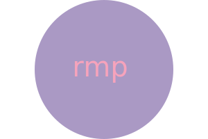
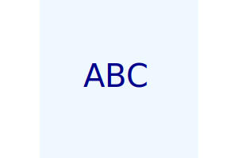
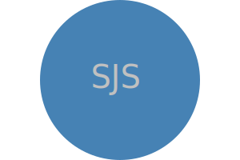

# SVG Logo Generator

## Description

A Node.js command-line application that prompts the user through Inquirer to select a color and shape, provide text and text color for the
logo, and save the generated SVG to a .svg file. The application followed OOD, and used Jest for running unit tests.

## Table of Contents

-  [User Story](#user-story)
-  [Acceptance Criteria](#acceptance-criteria)
-  [Application Examples](#application-examples)
-  [Deployment](#deployment)
-  [Credits](#credits)
-  [License](#license)
-  [Questions](#questions)

## User Story

```
AS a freelance web developer

I WANT to generate a simple logo for my projects

SO THAT I don't have to pay a graphic designer
```

## Acceptance Criteria

```
GIVEN a command-line application that accepts user input

WHEN I am prompted for text
THEN I can enter up to three characters

WHEN I am prompted for the text color
THEN I can enter a color keyword (OR a hexadecimal number)

WHEN I am prompted for a shape
THEN I am presented with a list of shapes to choose from: circle, triangle, and square

WHEN I am prompted for the shape's color
THEN I can enter a color keyword (OR a hexadecimal number)

WHEN I have entered input for all the prompts
THEN an SVG file is created named `logo.svg`
AND the output text "Generated logo.svg" is printed in the command line

WHEN I open the `logo.svg` file in a browser
THEN I am shown a 300x200 pixel image that matches the criteria I entered
```

## Application Examples

   

## Deployment

[SVG-Logo-Generator](https://github.com/ruthiepina/SVG-Logo-Generator)

## Credits

<https://www.w3schools.com/js/js_switch.asp> <https://en.wikipedia.org/wiki/SVG>
<https://developer.mozilla.org/en-US/docs/Web/SVG/Tutorial/Positions>
<https://developer.mozilla.org/en-US/docs/Web/SVG/Tutorial/Basic_Shapes> <https://www.w3.org/wiki/CSS/Properties/color/keywords>

## License

MIT

## Questions

SVG-Logo-Generator created by [Ruthie Pina](https://github.com/ruthiepina).

For any additional questions or comments, please send a message to the following address:

GitHub Email Address: <ruthiepina@gmail.com>
